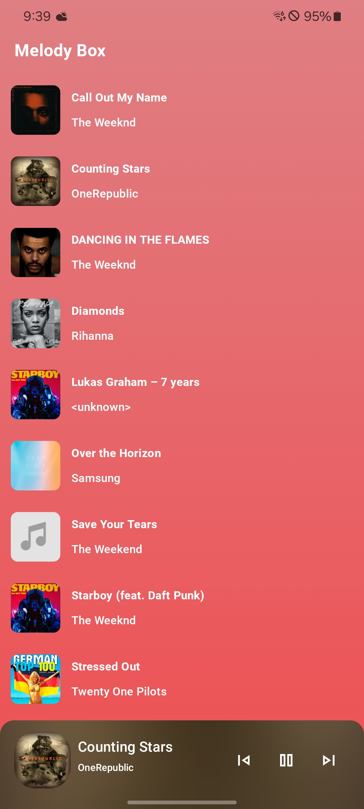
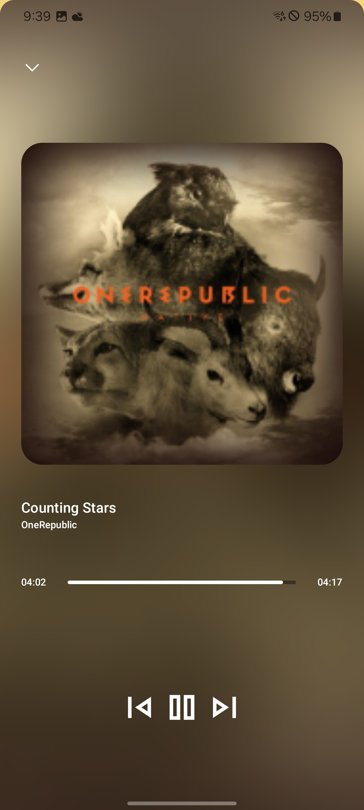
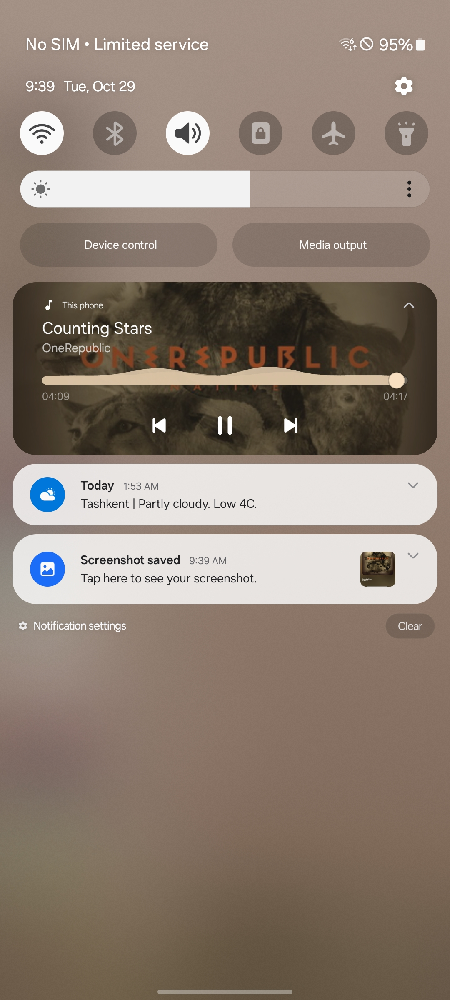

# 🎵 Melody Box  

**Melody Box** is a modern **music player app** designed to provide a seamless and delightful audio experience on Android. With an intuitive UI and smooth animations, the app makes it easy to manage and enjoy your favorite music.

## 📱 Screenshots 
| Home Screen              | Player Screen            |  Player Screen    |
|--------------------------|--------------------------|--------------------------|
|  |  | 

🎥 **[Watch Demo Video](./ezgif-5-75f4147c3a.gif)**  

## 🛠️ Technologies Used  
- **Jetpack Compose** – For building the UI  
- **MVI (Model-View-Intent)** – For state management  
- **Voyager** – Navigation library  
- **Hilt** – For dependency injection  
- **Orbit MVI** – State management framework  
- **Media 3** – For audio playback  
- **Motion Layout** – To create smooth animations  
- **Dexter** – For handling runtime permissions  

## 📲 Installation  
1. **Download the APK and install**: [Melody Box APK](https://github.com/BoburjonMurodov/MelodyBox/releases/download/release/app-release.apk)  
